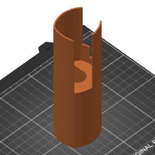

# Microphone Holder



This repository hosts the OpenSCAD source code and related artifacts for a model
of a microphone holder that a Rode NT USB microphone can sit in.

The related artifacts include the STL as generated by OpenSCAD, the PrusaSlicer
project 3MF file extracted into a directory using https://hubelbauer.art/3mf and
the GCode generated by PrusaSlicer for my Prusa MK3S.

The 3MF is transformed manually prior to every commit by running:

```sh
curl hubelbauer.art/3mf -L | sh
```
